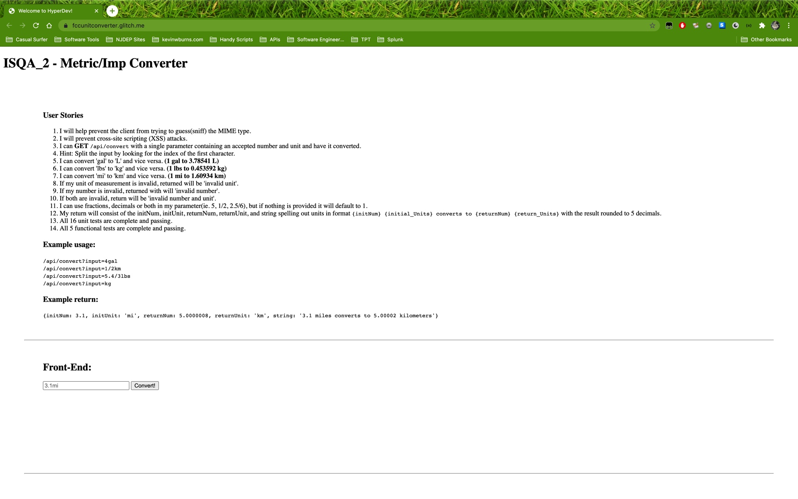

# Metric/Imperial Converter API
This project is an API that converts metric and imperial units. Can't you just type your conversion query into the Google search engine? You sure could! A note to tech leads and senior software devs: Welcome! You're likely here because you need to see my coding chops! Express and NodeJS examples (which aren't locked behind a previous client's privacy settings/guidelines or locked down by an NDA) must be created in my free time. Sharable projects are relegated to simple apps like these! I'm sure at least some of you can relate. :)

<p align="center">
  
  </p>


## Installation
You could clone the repo, click the download button, or just copy/paste the code into your code editor; it's only a few files. 

```bash
$ git clone https://github.com/kevintage83/metricImperialConverterAPI
```

## Usage (Windows)
```bash
cmd /c start metricImperialConverterAPI
```

## Usage (MacOS X)
```bash
open metricImperialConverterAPI
```

## Usage (Linux/Unix)
```bash
xdg-open metricImperialConverterAPI
```

## Contributing
At this time, I am not handling pull requests; this repo is primarily here to serve as a topic of dicussion among developers. Normally, if this were a repository where pull requests were welcome, I would ask that (for major changes, at least) you please open an issue first to discuss what you would like to change... but this is currently not the case.

I would also ask that you please make sure to update tests as appropriate.

## License
[MIT](https://choosealicense.com/licenses/mit/)
